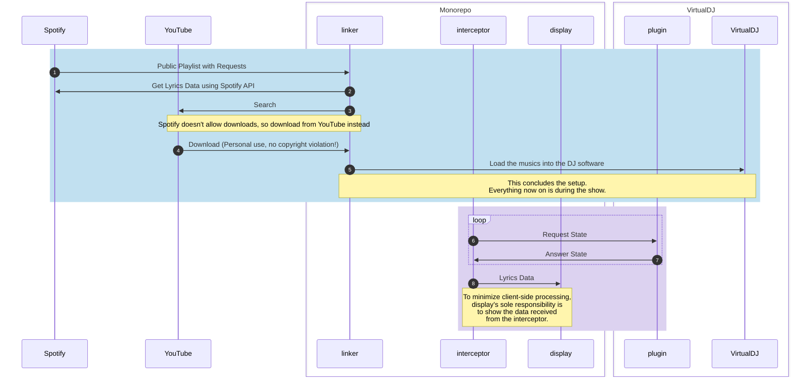

<h1 align='center'>
  project-448
</h1>

<h3 align='center'>
  Karaoke x VirtualDJ
</h3>

  

<h3 align='center'>
  System Overview
</h3>

```mermaid
sequenceDiagram
    autonumber
    
    participant Spotify
    participant YouTube

    box Monorepo
        participant linker
        participant interceptor
        participant display
    end

    box VirtualDJ
        participant plugin
        participant VirtualDJ
    end

    rect rgb(193, 224, 240)
    Spotify->>linker: Public Playlist with Requests
    linker->>Spotify: Get Lyrics Data using Spotify API
    linker->>YouTube: Search
    Note over linker,YouTube: Spotify doesn't allow downloads, so download from YouTube instead
    YouTube->>linker: Download (Personal use, no copyright violation!)
    linker->>VirtualDJ: Load the musics into the DJ software
    Note over linker,VirtualDJ: This concludes the setup. <br/> Everything now on is during the show.
    end
    rect rgb(220, 210, 240)
    loop
        interceptor->>plugin: Request State
        plugin->>interceptor: Answer State
    end
    interceptor->>display: Lyrics Data
    Note over interceptor,display: To minimize client-side processing, <br/> display's sole responsibility is <br/> to show the data received <br/> from the interceptor.
    end
```
